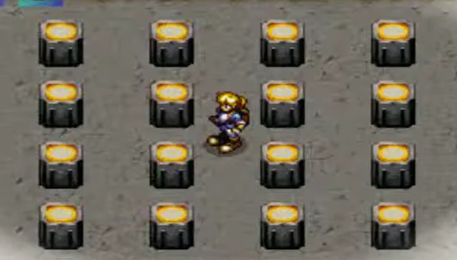

# kata-lights-out-1

**Kata 77 per a especialitats web 14-5-26**

Vull que programem una petita part de la lògica del videojoc Alundra de PSX.

Donada aquesta imatge:

 

- Tenim 4 files amb 4 elements.
- Cada element té dos estats possibles.
- L'estat de l'element varia al fer click en l'element provocant també el canvi d'estat
dels elements adjacents.

Es tracta de programar aquesta lògica, bàsicament.

- Si sou de front, podeu lluir-vos amb una bonica UI.
- Si sou de back podeu enraonar profundament la lògica darrera d'això sense aprofundir en la UI.
- Si sou de fullstack feu el que us roti :)

